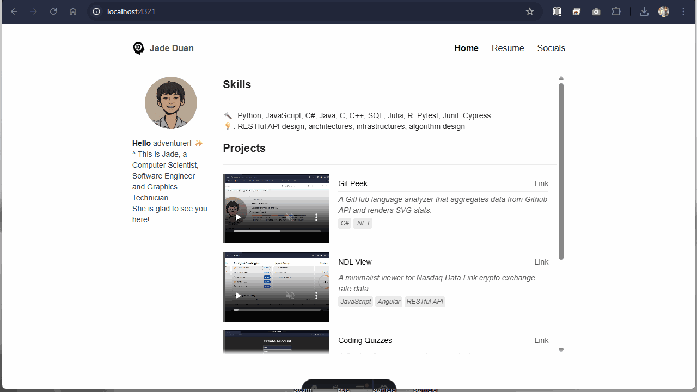
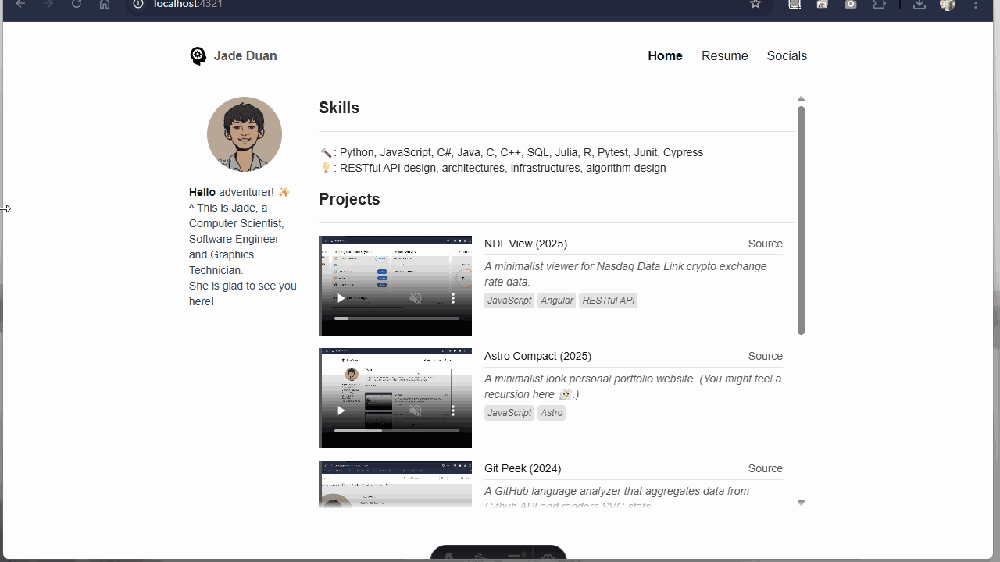

# Astro Compact

Minimalistic style personal portfolio website. Not really a template, but feel free to strip away my info and use this as a starter for your own portfolio site.

Narrow screen friendly.

## How to run

In initial state, run `npm install`. Afterwards, `npm run dev` each time.

## How to update contents

Update contents in these four places:
- *src/content/*      
    Markdowns like resume, and arrays like projects.
- *public/*      
    Large static assets like videos.
- *src/assets/*  
    Small static assets like avatar.
- *src/config.ts*  
    Global constants like site name. Probably rarely needs change.

# Acknowledgement

Sample video by <a href="https://pixabay.com/users/xbriantcx-36275440/?utm_source=link-attribution&utm_medium=referral&utm_campaign=video&utm_content=241802">Brian Tinco Custodio</a> from <a href="https://pixabay.com//?utm_source=link-attribution&utm_medium=referral&utm_campaign=video&utm_content=241802">Pixabay</a>

Download icon by Richard9394 from <a href="https://www.svgrepo.com/svg/431590/download-3">SVGRepo</a>.

Brain Engine icon by Icooon Mono from <a href="https://www.svgrepo.com/svg/483592/brain-engine">SVGRepo</a>.
